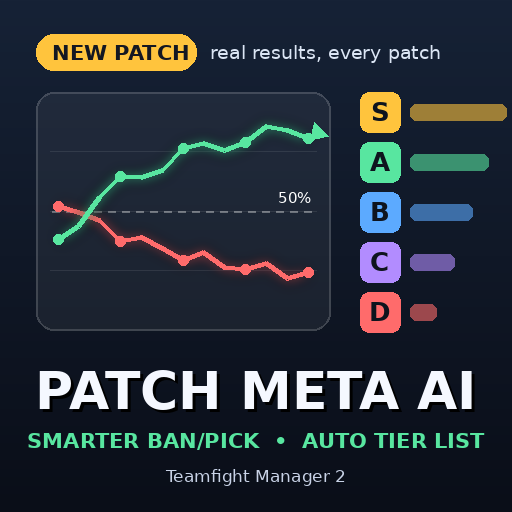

# Patch Meta AI — 选人顾问 + 更聪明的 Ban/Pick + 自动梯队（团战经理 2 / Teamfight Manager 2）

按你存档里的真实胜负数据工作的原生 Mod（稳定版 Mod API，游戏 0.6 及以上）。2.0 起，它用**一个统一的统计模型**同时估计英雄强度、分位置强度、选手实力与熟练度、队友配合和对位克制，然后：

1. **选人界面**：左下角显示你的阵容胜率，右下角给出当前最佳选择和禁用（附理由），每张英雄卡片显示此刻选它的价值，敌方每个已选英雄标出最可能的位置。选人顺序也算在内：对方后面还有几手、有没有强力克制，都会压低先手暴露的英雄的价值。Fearless 模式下显示本系列已锁定的英雄数。换位阶段，右下角改为显示把五个英雄分给五名选手的最佳方式。
2. **战术界面**：选完人后，模型按你的阵容和本存档里各战术的实际胜负，在值得改的战术选项上标出 ★ 和收益。
3. **首发界面**：按选手实力、位置评分和英雄池（熟练度）推荐五名首发，名单行上标 ★ 和位置；名单下方有空间时列出他们最好的英雄。
4. **版本分析页**（左侧菜单）：英雄 / 组合 / 选手 / 补丁变化 / 模型 五个标签。英雄表可按位置筛选、按任意列排序，显示对线期经济差；选手页给出训练建议（值得练的英雄）；补丁变化页列出本版本上升、下降和被改动的英雄。
5. **F8 面板**（任何界面）：梯队榜、下一个对手的侦察（每名选手的拿手英雄、常用英雄、最该禁的英雄）、你的选手英雄池、模型准确度。
6. **AI 的 ban/pick**：按本局局面给候选英雄估值（位置、配合、克制、伤害类型），推动 AI 原有评分。
7. **自动梯队**：维护你队伍的 S/A/B/C/D 英雄梯队。
8. **位置锁定（免设置）**：双方只会选还能放进剩余空位的英雄。英雄能打的位置自动判断：选人卡片上游戏标注的两个主位置，加上本存档里它实际打过足够多的位置。你自己选人时，不合适的英雄会变暗、点不了；没有合法选择时自动全部放开，不会卡住；禁用不受限制。
9. **报告**：Mod 文件夹里的 `meta_report.html`（浏览器打开，可排序、搜索）和 `meta_table.txt`。

数据全部来自你的存档：大会比赛、单排、球队新闻里的补丁公告。游戏会删掉很旧的比赛记录，所以 Mod 把每个存档的比赛另存在 Mod 文件夹的 `history/` 里（不改存档），下次读档时补回来；只有存档里最近的比赛确实出现在这个文件里时才会合并，同一支队伍的不同存档不会混在一起。

## 和其他 Mod 一起用

- **Bows' Drafter's Toolbox**：可以同时开。`tier_list=auto`（默认）检测到它时把梯队交给它；Toolbox 不改 AI 选人，所以本 Mod 的 AI 部分照常工作。两者在选人界面的标注位置不同（本 Mod 在卡片左上角和屏幕下方两角）；如果嫌挤，可以设 `grid_values=off`。
- **Bows' Terminator Draft AI**：它完全接管 AI 选人，`ban_pick=auto` 检测到它时自动让出。选人顾问、面板和报告照常工作。
- **Champion Position Lock**（tfm2mods / flover）：`position_lock=auto` 检测到它时把位置锁定让给它。两者不要同时用来锁位置。
- **yudra 的 Win-Rate Ban/Pick AI**（已停止更新）：会被检测到并让出梯队和 AI 选人，但建议直接停用它。

启用了哪些 Mod 是从游戏的 `config/game/mods.json` 读的。另外，如果梯队在游戏内换日后连续被别的东西改回去，本 Mod 也会自动停止写入并在 `diag.log` 里说明。

## 安装

- **手动安装**：把 `patch_meta_ai` 文件夹（含 `patch_meta_ai.dll`、`mod.mod_info`、`thumbnail.png`）放进 `<游戏目录>\mods\`，进游戏在 Mod 菜单里启用（含代码的 Mod 会弹一次确认），重启游戏。
- 只有 Windows 版（`.dll`）。

## 原理

所有比赛（最近 `patches` 个版本的大会比赛，加上按 `solo_weight` 计的单排）拟合一个带先验的逻辑回归：

`P(蓝方胜) = sigmoid(蓝方优势 + Σ蓝方[英雄强度 + 位置修正 + 选手实力 + 选手×英雄熟练度] − Σ红方[…] + Σ队友配合 − … + Σ对位克制)`

- **英雄强度按版本**：每个英雄在每个版本有一个强度，相邻版本之间是"随机游走"——没被改动时最多漂移约 `drift`，被补丁加强/削弱时最多变化约 `change`，并朝改动方向预移 `patch_shift`。所以改动前的比赛仍然计入，只是分量变小；新版本的少量比赛能把估计推多远，由模型自己按证据决定。
- **选手实力**：强队的拿手英雄不会因为"强队在用"而被高估。
- **所有效应都有先验**（往 0 收缩），场次少的配合、克制、熟练度会自然地接近 0。
- 拟合在后台线程进行（L-BFGS，大存档几十毫秒），不占游戏帧。

显示的"实力胜率"= 队友和选手都是平均水平时、这个英雄所在队伍的胜率。"争夺率"= 选用率 + 禁用率；"协同""压制"= 两个英雄同队或对位时，比各自实力预期多赢的胜率百分点。梯队按保守估计（强度减一个标准差）排序后按比例切分。

**选人顾问**对每个可选英雄计算：它在剩余位置里最常打的那个位置的强度 + 与已选队友的配合 + 对已选敌人的克制 + 将由哪名选手使用时的熟练度 − 伤害类型单一的惩罚。禁用价值 = 这个英雄对敌方的价值（含敌方对应选手的熟练度），按出场+禁用率加权。敌方位置推断用每个英雄的历史位置分布对所有分配方式加权，所以和游戏语言无关。

**模型自检**：读完存档后，用除最新 10% 外的比赛拟合，再在最新的比赛上打分（热门方获胜率、Brier 分数），结果写进 `diag.log`、报告和 F8 面板。

## 设置：`settings.ini`

第一次运行时自动生成，改完保存几秒内生效（模型相关的下次重建时生效），不用重启。删掉会重新生成默认值。1.x 的旧设置文件可以直接用，旧的模型参数会被忽略。

| 段落 | 键 | 默认 | 作用 |
|---|---|---|---|
| `[features]` | `ban_pick` / `tier_list` | auto / auto | AI 选人、自动梯队：`auto` = 开，除非已启用做同样事情的 Mod；`on` / `off` |
| `[model]` | `patches` | 12 | 模型回看的版本数（含当前） |
| | `drift` / `change` | 0.08 / 0.3 | 英雄强度每个版本的变化幅度：未改动 / 被补丁改动（对数几率） |
| | `patch_shift` | 0.02 | 补丁加强/削弱时起点预移的胜率 |
| | `solo_weight` | 0.5 | 一场单排算几场大会比赛 |
| | `reworked` | （空） | 本版本重做的英雄 id，历史数据几乎不计 |
| | `roles` `players` `mastery` `pairs` | 0.3 / 0.35 / 0.2 / 0.15 | 位置、选手、熟练度、配合/克制效应的先验幅度（越大越容易被数据推离 0） |
| `[draft]` | `pick_strength` / `ban_strength` | 1.0 / 0.8 | 对 AI 原有评分的影响力度 |
| | `edge_scale` | 0.5 | 价值（对数几率）换算成影响力的尺度：`tanh(价值 / edge_scale)` |
| `[tiers]` | `min_games` | 10 | 近期场次（本版本 + 往前每个版本减半）少于此值的英雄不分级 |
| | `s` `a` `b` `c` | 10/20/40/20 | 各梯队所占百分比，其余为 D |
| | `unranked` | keep | 证据不足的英雄：`keep` 保持原梯队，`clear` 设为无梯队 |
| `[position_lock]` | `position_lock` | auto | 位置锁定：`auto` = 开，除非已启用 "Champion Position Lock" Mod |
| | `lock_min_games` / `lock_share` | 8 / 0.15 | 英雄至少打过这么多场、某位置占比至少这么多，才把该位置算作它能打的位置 |
| `[screen]` | `draft_overlay` | on | 选人界面的胜率和建议，以及战术界面、首发界面的推荐 |
| | `grid_values` | on | 英雄卡片上的价值 |
| | `lane_tags` | on | 敌方已选英雄的位置推断 |
| | `meta_page` | on | 左侧菜单的"版本分析"页 |
| `[report]` | `report` | on | 写 `meta_report.html` |
| `[debug]` | `explore` | off | 把每个新界面的 UI 结构写进 `ui_dump_*.txt`（按 F9 随时写一份） |
| | `verbose` | off | 在 `diag.log` 里写更多细节 |

## 快捷键

- **F8**：打开 Meta 面板 / 下一页 / 最后一页后关闭。
- **F9**：把当前界面的 UI 结构写进 `ui_dump_*.txt`（反馈界面问题时用）。

## 出问题时看这些文件

都在 Mod 文件夹里：

- `diag.log`：Mod 读到了什么、做了什么（每个存档第一次读到的数据格式写在 `[probe]` 行，选人界面读到了什么写在 `[ui]` 行）。每次启动游戏重写，上一次的保留为 `diag.prev.log`。反馈问题时请附上它。
- `meta_table.txt` / `meta_report.html`：模型当前的全部数字。
- `history/`：各存档的比赛备份（删掉只会丢失游戏已删除的旧比赛）；`positions.json`：学到的英雄主位置。
- `probe_competition.json`、`probe_records.txt`：存档数据格式样本（游戏更新后数据格式变了时用来适配）。

## 从源码构建

- Windows：装好 Rust 后在仓库根目录 `cargo build --release`，得到 `target\release\patch_meta_ai.dll`。
- Linux/WSL：`tools/build.sh`，需要 `rustup target add x86_64-pc-windows-gnu` 和 `gcc-mingw-w64-x86-64`。它会跑测试、交叉编译、打包出 `dist/patch_meta_ai/` 和 zip。加 `--smoke` 还会用 Wine 真正加载 DLL，跑一遍模拟的游戏流程。
- `cargo test`：单元测试（模型能否从模拟比赛中找回已知的英雄强度、选手实力、配合；补丁改动后的估计；选人界面读写），加上走真实 C 接口的整局模拟（`tests/fake_host.rs`）。`cargo test --release -- --ignored --nocapture fit_time` 测一次存档规模的拟合耗时。

`vendor/mod-api-stable` 是游戏自带的稳定版 Mod SDK（`mod-sdk-stable`，0.6.2，ABI 等级 9），版权归 TeamSamoyed。

## 致谢

"按胜率调整 ban/pick + 自动梯队"的思路最早来自 yudra 的创意工坊 Mod「Win-Rate Ban/Pick AI + Champion Tiers」，失效原因见 [docs/background.md](docs/background.md)。选人界面标注、高级统计、对手位置标签等功能方向受 Bowsori 的「Drafter's Toolbox」「Terminator Draft AI」启发；UI 路径和界面重建的经验参考了 shirograhm 的开源 Mod「Riot Games Item Expansion Pack」（MIT）。本 Mod 是独立实现，代码、模型、设置和美术都是自己的。

## English

Patch Meta AI is a native Teamfight Manager 2 mod (stable mod API, game 0.6+). Version 2 fits one regularised logistic regression over your save's matches - champion strength per patch (a random walk across patches, wider where the patch notes changed a champion), lane offsets, each player's own strength and champion mastery, ally synergy and opponent matchups - on a background thread, and uses it for:

1. **the ban/pick screen**: your line-up's win chance, the best picks and bans now with reasons (aware of the draft order: a champion picked early can still be countered), each champion card's value to you, each enemy pick's likely lane, the Fearless count, and the best seating in the swap phase;
2. **the tactics screen**: a star on each tactic option worth changing for your line-up, with its gain;
3. **the line-up screen**: the five suggested starters (strength, position rating, champion pool);
4. **a Meta Analysis page** in the left menu: champions (lane filter, lane-phase gold), pairs, players with training suggestions, patch changes, the model;
5. **an F8 panel** on any screen: tier list, scouting of your next opponent, your players' pools, the model's held-out accuracy;
6. **the AI's bans and picks**, valued in the actual draft, with a position lock that needs no setup;
7. **your team's tier list**;
8. **`meta_report.html`** and `meta_table.txt` in the mod folder.

The game prunes old match records; each save's matches are also kept in `history/` in the mod folder (never in the save) and merged back once the save's recent matches confirm the file is its own.

- `ban_pick` / `tier_list` default to `auto`: they step aside for Drafter's Toolbox (tiers) and Terminator Draft AI (AI draft), read from the game's `mods.json`.
- Settings in `settings.ini` are hot-reloaded; `diag.log` shows what the mod sees; F9 dumps the UI tree for bug reports.
- Build with `cargo build --release` on Windows, or `tools/build.sh` from Linux.
- MIT licensed. `vendor/mod-api-stable` is TeamSamoyed's SDK.
